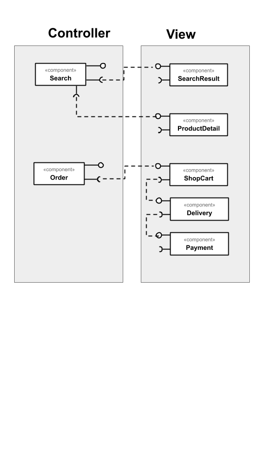
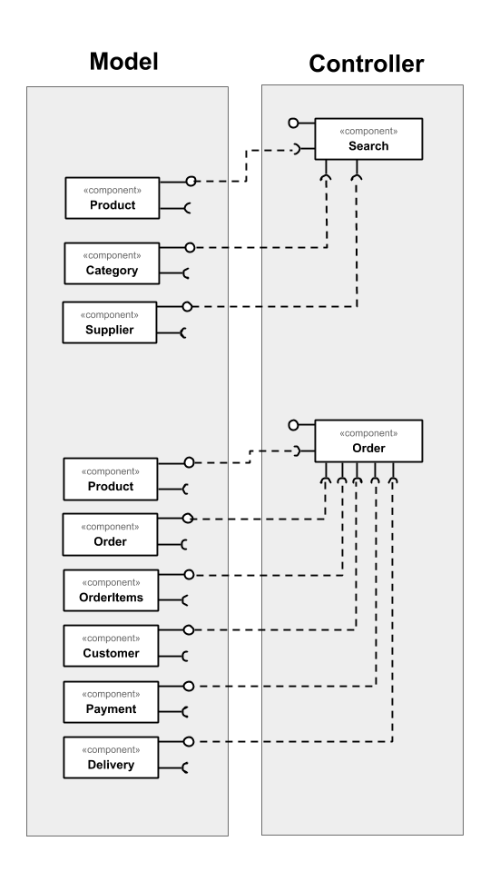

# Lab04 - Serviços

## Tarefa 1

## Tarefa 2

## Tarefa 3

## Tarefa 4

### Serviço `Data USA`

* **Título do serviço:** `Data USA`
* **Breve descrição:**
  Serviço que disponibiliza através de APIs os dados públicos do governo dos Estados Unidos.
* **URL completa da requisição:** `https://datausa.io/api/data?drilldowns=State&measures=Population&year=latest`
* **Cabeçalho HTTP da chamada**:
~~~http
:authority: datausa.io
:method: GET
:path: /api/data?drilldowns=State&measures=Population&year=latest
:scheme: https
accept: text/html,application/xhtml+xml,application/xml;q=0.9,image/webp,image/apng,*/*;q=0.8,application/signed-exchange;v=b3
accept-encoding: gzip, deflate, br
accept-language: pt-BR,pt;q=0.9,en-US;q=0.8,en;q=0.7
cache-control: no-cache
cookie: __cfduid=dce412b5cb7a1be046df8fb94506a26fa1598289065; _ga=GA1.2.1278844842.1598289091; _gid=GA1.2.1274851064.1598289091; _hjid=691bff5e-350f-44d6-8780-1497cae4e536; _hjAbsoluteSessionInProgress=0; _gat=1
pragma: no-cache
sec-fetch-mode: navigate
sec-fetch-site: none
upgrade-insecure-requests: 1
user-agent: Mozilla/5.0 (X11; Linux x86_64) AppleWebKit/537.36 (KHTML, like Gecko) Chrome/77.0.3865.90 Safari/537.36
~~~
* **Cabeçalho HTTP da resposta**:
~~~http
access-control-allow-credentials: true
access-control-allow-headers: dnt,x-customheader,keep-alive,user-agent,x-requested-with,if-modified-since,cache-control,content-type
access-control-allow-methods: get, post, options
access-control-allow-origin: *
cache-control: max-age=1800
cf-cache-status: MISS
cf-ray: 5c7ee0c02bac09f0-GIG
cf-request-id: 04c32acc16000009f0d6936200000001
content-encoding: br
content-language: canon
content-type: application/json; charset=utf-8
date: Mon, 24 Aug 2020 17:43:51 GMT
etag: W/"1a0a-3qGPt3ldfF3mZ8zfcHIw3s4Tm4A"
expect-ct: max-age=604800, report-uri="https://report-uri.cloudflare.com/cdn-cgi/beacon/expect-ct"
server: cloudflare
status: 200
vary: Accept-Encoding
x-cache-status: HIT
x-powered-by: Express
~~~
* **Conteúdo da resposta**:
~~~json
{"data":[{"ID State":"04000US30","State":"Montana","ID Year":2018,"Year":"2018","Population":1062305,"Slug State":"montana"},{"ID State":"04000US01","State":"Alabama","ID Year":2018,"Year":"2018","Population":4887871,"Slug State":"alabama"},{"ID State":"04000US04","State":"Arizona","ID Year":2018,"Year":"2018","Population":7171646,"Slug State":"arizona"},{"ID State":"04000US05","State":"Arkansas","ID Year":2018,"Year":"2018","Population":3013825,"Slug State":"arkansas"},{"ID State":"04000US06","State":"California","ID Year":2018,"Year":"2018","Population":39557045,"Slug State":"california"},{"ID State":"04000US08","State":"Colorado","ID Year":2018,"Year":"2018","Population":5695564,"Slug State":"colorado"},{"ID State":"04000US09","State":"Connecticut","ID Year":2018,"Year":"2018","Population":3572665,"Slug State":"connecticut"},{"ID State":"04000US10","State":"Delaware","ID Year":2018,"Year":"2018","Population":967171,"Slug State":"delaware"},{"ID State":"04000US11","State":"District of Columbia","ID Year":2018,"Year":"2018","Population":702455,"Slug State":"district-of-columbia"},{"ID State":"04000US12","State":"Florida","ID Year":2018,"Year":"2018","Population":21299325,"Slug State":"florida"},{"ID State":"04000US13","State":"Georgia","ID Year":2018,"Year":"2018","Population":10519475,"Slug State":"georgia"},{"ID State":"04000US15","State":"Hawaii","ID Year":2018,"Year":"2018","Population":1420491,"Slug State":"hawaii"},{"ID State":"04000US16","State":"Idaho","ID Year":2018,"Year":"2018","Population":1754208,"Slug State":"idaho"},{"ID State":"04000US17","State":"Illinois","ID Year":2018,"Year":"2018","Population":12741080,"Slug State":"illinois"},{"ID State":"04000US18","State":"Indiana","ID Year":2018,"Year":"2018","Population":6691878,"Slug State":"indiana"},{"ID State":"04000US19","State":"Iowa","ID Year":2018,"Year":"2018","Population":3156145,"Slug State":"iowa"},{"ID State":"04000US20","State":"Kansas","ID Year":2018,"Year":"2018","Population":2911510,"Slug State":"kansas"},{"ID State":"04000US21","State":"Kentucky","ID Year":2018,"Year":"2018","Population":4468402,"Slug State":"kentucky"},{"ID State":"04000US22","State":"Louisiana","ID Year":2018,"Year":"2018","Population":4659978,"Slug State":"louisiana"},{"ID State":"04000US23","State":"Maine","ID Year":2018,"Year":"2018","Population":1338404,"Slug State":"maine"},{"ID State":"04000US24","State":"Maryland","ID Year":2018,"Year":"2018","Population":6042718,"Slug State":"maryland"},{"ID State":"04000US25","State":"Massachusetts","ID Year":2018,"Year":"2018","Population":6902149,"Slug State":"massachusetts"},{"ID State":"04000US26","State":"Michigan","ID Year":2018,"Year":"2018","Population":9995915,"Slug State":"michigan"},{"ID State":"04000US27","State":"Minnesota","ID Year":2018,"Year":"2018","Population":5611179,"Slug State":"minnesota"},{"ID State":"04000US28","State":"Mississippi","ID Year":2018,"Year":"2018","Population":2986530,"Slug State":"mississippi"},{"ID State":"04000US29","State":"Missouri","ID Year":2018,"Year":"2018","Population":6126452,"Slug State":"missouri"},{"ID State":"04000US02","State":"Alaska","ID Year":2018,"Year":"2018","Population":737438,"Slug State":"alaska"},{"ID State":"04000US31","State":"Nebraska","ID Year":2018,"Year":"2018","Population":1929268,"Slug State":"nebraska"},{"ID State":"04000US32","State":"Nevada","ID Year":2018,"Year":"2018","Population":3034392,"Slug State":"nevada"},{"ID State":"04000US33","State":"New Hampshire","ID Year":2018,"Year":"2018","Population":1356458,"Slug State":"new-hampshire"},{"ID State":"04000US34","State":"New Jersey","ID Year":2018,"Year":"2018","Population":8908520,"Slug State":"new-jersey"},{"ID State":"04000US35","State":"New Mexico","ID Year":2018,"Year":"2018","Population":2095428,"Slug State":"new-mexico"},{"ID State":"04000US36","State":"New York","ID Year":2018,"Year":"2018","Population":19542209,"Slug State":"new-york"},{"ID State":"04000US37","State":"North Carolina","ID Year":2018,"Year":"2018","Population":10383620,"Slug State":"north-carolina"},{"ID State":"04000US38","State":"North Dakota","ID Year":2018,"Year":"2018","Population":760077,"Slug State":"north-dakota"},{"ID State":"04000US39","State":"Ohio","ID Year":2018,"Year":"2018","Population":11689442,"Slug State":"ohio"},{"ID State":"04000US40","State":"Oklahoma","ID Year":2018,"Year":"2018","Population":3943079,"Slug State":"oklahoma"},{"ID State":"04000US41","State":"Oregon","ID Year":2018,"Year":"2018","Population":4190713,"Slug State":"oregon"},{"ID State":"04000US42","State":"Pennsylvania","ID Year":2018,"Year":"2018","Population":12807060,"Slug State":"pennsylvania"},{"ID State":"04000US44","State":"Rhode Island","ID Year":2018,"Year":"2018","Population":1057315,"Slug State":"rhode-island"},{"ID State":"04000US45","State":"South Carolina","ID Year":2018,"Year":"2018","Population":5084127,"Slug State":"south-carolina"},{"ID State":"04000US46","State":"South Dakota","ID Year":2018,"Year":"2018","Population":882235,"Slug State":"south-dakota"},{"ID State":"04000US47","State":"Tennessee","ID Year":2018,"Year":"2018","Population":6770010,"Slug State":"tennessee"},{"ID State":"04000US48","State":"Texas","ID Year":2018,"Year":"2018","Population":28701845,"Slug State":"texas"},{"ID State":"04000US49","State":"Utah","ID Year":2018,"Year":"2018","Population":3161105,"Slug State":"utah"},{"ID State":"04000US50","State":"Vermont","ID Year":2018,"Year":"2018","Population":626299,"Slug State":"vermont"},{"ID State":"04000US51","State":"Virginia","ID Year":2018,"Year":"2018","Population":8517685,"Slug State":"virginia"},{"ID State":"04000US53","State":"Washington","ID Year":2018,"Year":"2018","Population":7535591,"Slug State":"washington"},{"ID State":"04000US54","State":"West Virginia","ID Year":2018,"Year":"2018","Population":1805832,"Slug State":"west-virginia"},{"ID State":"04000US55","State":"Wisconsin","ID Year":2018,"Year":"2018","Population":5813568,"Slug State":"wisconsin"},{"ID State":"04000US56","State":"Wyoming","ID Year":2018,"Year":"2018","Population":577737,"Slug State":"wyoming"},{"ID State":"04000US72","State":"Puerto Rico","ID Year":2018,"Year":"2018","Population":3195153,"Slug State":"puerto-rico"}],"source":[{"measures":["Population"],"annotations":{"source_name":"Census Bureau","source_description":"The American Community Survey (ACS) is conducted by the US Census and sent to a portion of the population every year.","dataset_name":"ACS 1-year Estimate","dataset_link":"http://www.census.gov/programs-surveys/acs/","table_id":"B01003","topic":"Diversity","subtopic":"Demographics"},"name":"acs_yg_total_population_1","substitutions":[]}]}
~~~

### Serviço `Public APIs`

* **Título do serviço:** `Public API for Public APIs`
* **Breve descrição:**
  Serviço que permite pesquisar APIs públicas, filtrando por categoria e suporte a HTTPS 
* **URL completa da requisição:** `https://api.publicapis.org/entries?category=sports&https=true`
* **Cabeçalho HTTP da chamada**:
~~~http
:authority: api.publicapis.org
:method: GET
:path: /entries?category=sports&https=true
:scheme: https
accept: text/html,application/xhtml+xml,application/xml;q=0.9,image/webp,image/apng,*/*;q=0.8,application/signed-exchange;v=b3
accept-encoding: gzip, deflate, br
accept-language: pt-BR,pt;q=0.9,en-US;q=0.8,en;q=0.7
cache-control: no-cache
pragma: no-cache
sec-fetch-mode: navigate
sec-fetch-site: none
sec-fetch-user: ?1
upgrade-insecure-requests: 1
user-agent: Mozilla/5.0 (X11; Linux x86_64) AppleWebKit/537.36 (KHTML, like Gecko) Chrome/77.0.3865.90 Safari/537.36
~~~
* **Cabeçalho HTTP da resposta**:
~~~http
access-control-allow-origin: *
content-length: 2802
content-type: application/json
date: Mon, 24 Aug 2020 17:52:47 GMT
server: Caddy
status: 200
x-rate-limit-duration: 1
x-rate-limit-limit: 10.00
x-rate-limit-request-forwarded-for: 191.255.48.36
x-rate-limit-request-remote-addr: 172.17.0.1:57594
~~~
* **Conteúdo da resposta**:
~~~json
{"count":13,"entries":[{"API":"balldontlie","Description":"Ballldontlie provides access to stats data from the NBA","Auth":"","HTTPS":true,"Cors":"yes","Link":"https://balldontlie.io","Category":"Sports \u0026 Fitness"},{"API":"BikeWise","Description":"Bikewise is a place to learn about and report bike crashes, hazards and thefts","Auth":"","HTTPS":true,"Cors":"unknown","Link":"https://www.bikewise.org/documentation/api_v2","Category":"Sports \u0026 Fitness"},{"API":"Canadian Football League (CFL)","Description":"Official JSON API providing real-time league, team and player statistics about the CFL","Auth":"apiKey","HTTPS":true,"Cors":"no","Link":"http://api.cfl.ca/","Category":"Sports \u0026 Fitness"},{"API":"Ergast F1","Description":"F1 data from the beginning of the world championships in 1950","Auth":"","HTTPS":true,"Cors":"unknown","Link":"http://ergast.com/mrd/","Category":"Sports \u0026 Fitness"},{"API":"Fitbit","Description":"Fitbit Information","Auth":"OAuth","HTTPS":true,"Cors":"unknown","Link":"https://dev.fitbit.com/","Category":"Sports \u0026 Fitness"},{"API":"Football (Soccer) Videos","Description":"Embed codes for goals and highlights from Premier League, Bundesliga, Serie A and many more","Auth":"","HTTPS":true,"Cors":"yes","Link":"https://www.scorebat.com/video-api/","Category":"Sports \u0026 Fitness"},{"API":"Football Prediction","Description":"Predictions for upcoming football matches, odds, results and stats","Auth":"X-Mashape-Key","HTTPS":true,"Cors":"unknown","Link":"https://boggio-analytics.com/fp-api/","Category":"Sports \u0026 Fitness"},{"API":"JCDecaux Bike","Description":"JCDecaux's self-service bicycles","Auth":"apiKey","HTTPS":true,"Cors":"unknown","Link":"https://developer.jcdecaux.com/","Category":"Sports \u0026 Fitness"},{"API":"NBA Stats","Description":"Current and historical NBA Statistics","Auth":"","HTTPS":true,"Cors":"unknown","Link":"https://any-api.com/nba_com/nba_com/docs/API_Description","Category":"Sports \u0026 Fitness"},{"API":"NHL Records and Stats","Description":"NHL historical data and statistics","Auth":"","HTTPS":true,"Cors":"unknown","Link":"https://gitlab.com/dword4/nhlapi","Category":"Sports \u0026 Fitness"},{"API":"Strava","Description":"Connect with athletes, activities and more","Auth":"OAuth","HTTPS":true,"Cors":"unknown","Link":"https://strava.github.io/api/","Category":"Sports \u0026 Fitness"},{"API":"TheSportsDB","Description":"Crowd-Sourced Sports Data and Artwork","Auth":"apiKey","HTTPS":true,"Cors":"yes","Link":"https://www.thesportsdb.com/api.php","Category":"Sports \u0026 Fitness"},{"API":"Wger","Description":"Workout manager data as exercises, muscles or equipment","Auth":"apiKey","HTTPS":true,"Cors":"unknown","Link":"https://wger.de/en/software/api","Category":"Sports \u0026 Fitness"}]}

~~~