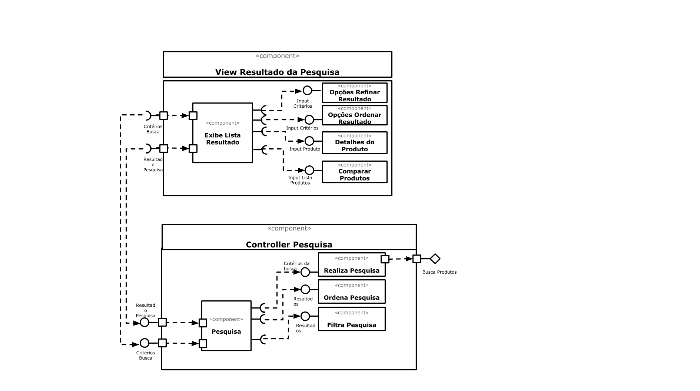

# Lab05 - Subcomponentes e Páginas Dinâmicas

## Tarefa 1

## Tarefa 2
Link para o projeto no Codepen: [React - Subcomponentes](https://codepen.io/marchioreto/pen/zYqdmYg)

**HTML**
~~~html

~~~

**JavaScript**
~~~javascript
class Barra extends React.Component {
  render() {
    let resultado = "";
    for (let b = 1; b <= this.props.tamanho; b++)
      resultado += "=";
    return resultado;
  }
}

class PersonagemOpcoes extends React.Component {
  constructor(props) {
    super(props);
    this.state = {personagem: ''};
    this.handleChange = this.handleChange.bind(this);  
  }
  
  handleChange(event) {
    this.setState({personagem: event.target.value});
  }
  
  render() {
    return (
      

        <select onChange={this.handleChange}>
          <option value="">Selecione um personagem</option>
          <option value="Dinossauro">Dinossauro</option>
          <option value="Dragão">Dragão</option>
          <option value="Saci Pererê">Saci Pererê</option>
        </select>
        {
          this.state.personagem !== '' &&
            <PersonagemSelecionado personagem={this.state.personagem} />  
        }
        
      

    )
  }
}

function PersonagemSelecionado({personagem}) {
  return (
    

      <h2>O {personagem}</h2>
      <Barra tamanho="10"/>
      <h2>pulou na lama.</h2>
    

  )  
}

const elemento = 
                
                   <PersonagemOpcoes />                   
                 

ReactDOM.render(elemento, 
        document.getElementById("root"));
~~~